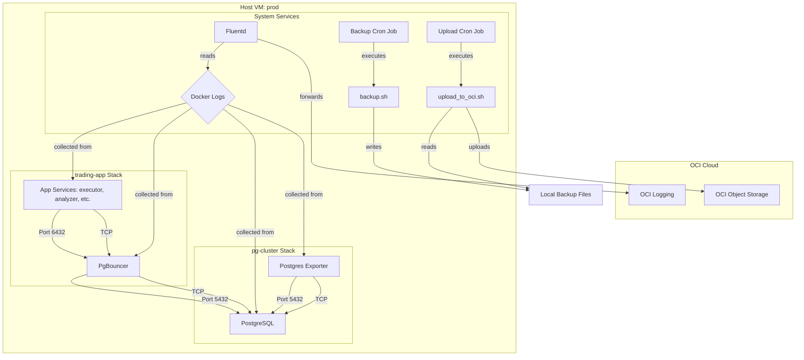

# Database Operations Manual: Central PostgreSQL Cluster

**Version:** 1.1 (Final)
**Date:** 2025-09-12
**Primary Operator:** `opc` user on `prod` server

## 1. Architecture Overview

This document outlines the operations for the central PostgreSQL database stack deployed on the OCI VM `prod`. The architecture is a decoupled, multi-container system orchestrated by Docker Compose, designed for reliability, security, and maintainability.

### 1.1. Host & Container Layout

The system is deployed across dedicated directories in `/opt`, enforcing a strict separation of concerns between the database infrastructure, applications, and supporting services.

```plaintext
/opt/
├── pg-cluster/             # The Database Infrastructure Stack
│   ├── docker-compose.yml  # Defines db, pgbouncer, exporter
│   ├── .env                # Secrets for the database stack
│   ├── bin/                # Backup and maintenance scripts
│   ├── config/             # Persistent configs (postgres, pgbouncer)
│   ├── logs/               # Host-mounted logs for startup debugging
│   └── backups/            # Local storage for pg_dump files
│
├── apps/                   # Application Stacks
│   └── trading-app/        # The primary application
│       ├── docker-compose.yml
│       └── ... (application source code)
│
├── secrets/                # Centralized, shared secrets
│   └── trading_app_password.txt
│
└── fluentd/                # Centralized Log Forwarding Service
    ├── docker-compose.yml
    ├── .env
    ├── build/
    │   └── Dockerfile
    └── config/
```

### 1.2. Service Interaction Diagram



## 2. Oracle Linux 10 & ARM64: Technical Challenges & Solutions

**Maintainer Advisory:** The deployment on a new Oracle Linux 10 (`aarch64`) instance presented significant, non-obvious challenges. The solutions below were critical for a successful deployment and should be the first point of reference for troubleshooting similar issues.

- **Challenge 1: Docker Engine Installation**
    - **Problem:** Standard Docker installation methods failed. The official DNF repository for Oracle Linux 10 did not exist (404 error), and the official `get.docker.com` convenience script did not support the `ol/10` distribution.
    - **Solution:** We manually configured `dnf` to use the official Docker repository for **CentOS 9**. As Oracle Linux is a downstream derivative of RHEL (as is CentOS), this provided a stable, compatible, and package-manager-aware installation method.

- **Challenge 2: ARM64 (`aarch64`) Container Image Incompatibility**
    - **Problem:** Multiple pre-built community and official Docker images failed to run, producing `manifest unknown` or `exec format error` messages. This affected our initial choices for PgBouncer and Fluentd.
    - **Solution:** We adopted a "build from source" strategy. For both `PgBouncer` and `Fluentd`, we created custom `Dockerfile`s. This involved starting from a stable, multi-platform base image (`postgres:16` or `debian:bookworm-slim`) and using the native package manager (`apt`) and compilers (`gem`) to build a native `arm64` version of the required software. This is the definitive pattern for ensuring compatibility on ARM architectures.

- **Challenge 3: System Package Dependency Conflicts**
    - **Problem:** A default `dnf update` failed due to a dependency conflict between the pre-installed `python3-oci-sdk` (requiring an older `pyOpenSSL`) and the newer version of `pyOpenSSL` available in the EPEL repository.
    - **Solution:** The system update command was modified to `dnf update -y --exclude=python3-pyOpenSSL`. This preserves the integrity of the pre-installed OCI tools while allowing the rest of the system to be patched.

- **Challenge 4: OCI CLI Syntax for Complex Arguments**
    - **Problem:** The `oci network vnic update` command repeatedly failed with `Got unexpected extra argument` errors, despite various shell quoting attempts.
    - **Solution:** The most robust method was to bypass shell quoting entirely by passing the arguments via a temporary JSON file using the `--from-json file://...` flag. For one-off actions, performing the association in the OCI web console is the simplest workaround.

## 3. Key Configurations & Justifications

- **Database Engine:** `pgvector/pgvector:pg17` was chosen to support future vector embedding workloads.
- **Connection Pooling:** A **custom PgBouncer image** was built from the `postgres:16` base to ensure ARM64 compatibility. It runs in `transaction` pooling mode to handle high connection churn from the microservices.
- **Log Forwarding:** A **custom Fluentd image** was built from `debian:bookworm-slim` to resolve ARM64 binary incompatibilities. This service provides a resilient, decoupled mechanism for shipping all container logs to OCI.
- **Schema Management:** `Alembic` provides version-controlled, repeatable, and non-destructive schema migrations. The initial schema was created from `init.sql` in migration `0e8959d7e93b`.
- **Secret Management:** A single source of truth for the application database password is held in `/opt/secrets/trading_app_password.txt`.

## 4. Runbooks

### 4.1. Backup & Restore

#### Local Backup
- **Automation:** A cron job runs `/opt/pg-cluster/bin/backup.sh` daily at 03:05 GMT.
- **Process:** Performs a `pg_dump` and stores it in `/opt/pg-cluster/backups/daily/`.
- **Retention:** The script automatically prunes local backups older than 7 days.

#### Off-site Backup
- **Automation:** A cron job runs `/opt/pg-cluster/bin/upload_to_oci.sh` daily at 03:15 GMT.
- **Process:** Uploads the latest local backup to the OCI Object Storage bucket.

#### Restore Procedure (Emergency)
1.  **Identify Backup:** Locate the desired backup file from OCI Object Storage or local backups.
2.  **Stop Application:** `cd /opt/apps/trading-app && sudo docker compose down`
3.  **Connect to DB:** `sudo docker exec -it postgres_db psql -U postgres_admin -d postgres`
4.  **Drop & Recreate:** Inside `psql`, drop the old database and create a new empty one.
    ```sql
    DROP DATABASE trading_db;
    CREATE DATABASE trading_db;
    \q
    ```
5.  **Execute Restore:** Use `pg_restore` to load the backup file.
    ```bash
    gunzip -c /path/to/backup-file.sql.gz.custom | sudo docker exec -i postgres_db pg_restore -U postgres_admin -d trading_db
    ```
6.  **Restart Application:** `cd /opt/apps/trading-app && sudo docker compose --profile full up -d`

## 5. Monitoring Plan

- **Host Metrics (CPU, Memory):** Alarms are configured in the OCI Console under **Compute -> Instances -> [Instance Name] -> Alarms**. Notifications are sent via the `critical-server-alerts` topic.
- **Container Logs:** All container `stdout`/`stderr` logs are captured by Docker as JSON files. A dedicated **Fluentd container** (in `/opt/fluentd`) tails these files and forwards them to **OCI Logging**. Logs can be explored in the OCI Console under **Observability & Management -> Logs**.
- **Database Metrics:** The `postgres_exporter` service exposes detailed PostgreSQL metrics on port `9187`.

## 6. Future Improvements & Growth Path

- **High Availability (HA):** The current setup has a single point of failure. A future architecture should include a standby PostgreSQL replica and a floating IP for automated failover.
- **Advanced Monitoring:** Deploy a full Prometheus/Grafana stack to scrape the `postgres_exporter` and `node-exporter` metrics, providing dashboards and more sophisticated alerting.
- **Secrets Management:** For a multi-server or team environment, migrate secrets from local files to a dedicated secrets management service like OCI Vault.
- **Data Lifecycle Management:** Implement automated policies in the OCI Object Storage bucket to move older backups to cheaper Infrequent Access or Archive storage tiers.
