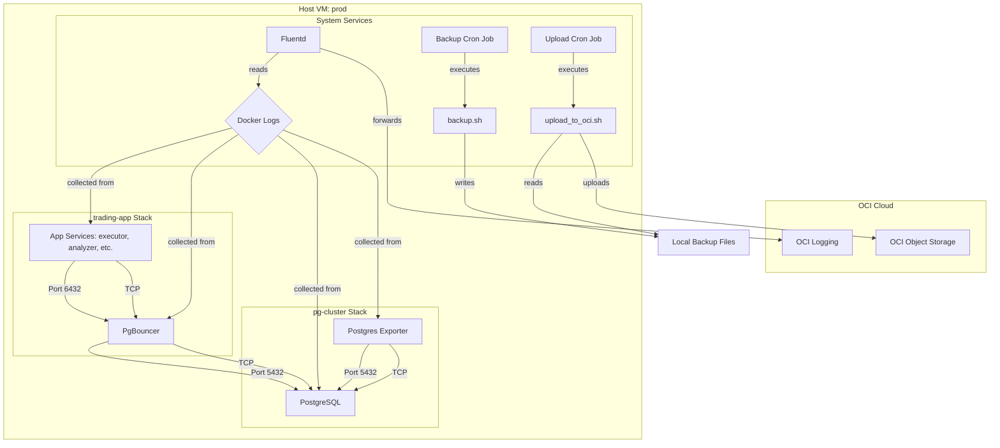

# Database Operations Manual: Central PostgreSQL Cluster

**Version:** 1.0
**Date:** 2025-09-12
**Primary Operator:** `opc` user on `prod` server

## 1. Architecture Overview

This document outlines the operations for the central PostgreSQL database stack deployed on the OCI VM `prod`. The architecture is a decoupled, multi-container system orchestrated by Docker Compose, designed for reliability, security, and maintainability.

### 1.1. Host & Container Layout

The system is deployed across two primary directories on the host, enforcing a strict separation between the database infrastructure and the applications that consume it.

```plaintext
/opt/
├── pg-cluster/             # The Database Infrastructure Stack
│   ├── docker-compose.yml  # Defines db, pgbouncer, exporter
│   ├── .env                # Secrets for the database stack
│   ├── bin/                # Backup and maintenance scripts
│   ├── config/             # Persistent configs (postgres, pgbouncer)
│   ├── data/               # (DEPRECATED - see pg_data volume)
│   ├── logs/               # Host-mounted logs for startup debugging
│   └── backups/            # Local storage for pg_dump files
│
├── apps/                   # Application Stacks
│   └── trading-app/        # The primary application
│       ├── docker-compose.yml
│       └── ... (application source code)
│
├── secrets/                # Centralized, shared secrets
│   └── trading_app_password.txt
│
└── fluentd/                # Log forwarding service
    ├── docker-compose.yml
    └── config/
```

### 1.2. Service Interaction Diagram



## 2. Key Configurations & Justifications

- **Database Engine:** `pgvector/pgvector:pg17` was chosen to support future vector embedding workloads.
- **Connection Pooling:** `PgBouncer` is used in `transaction` pooling mode to handle high connection churn from the microservices, preventing exhaustion of the main database's connection limit.
- **Schema Management:** `Alembic` is used to provide version-controlled, repeatable, and non-destructive schema migrations. The initial schema was created from `init.sql` in migration `0e8959d7e93b`.
- **Decoupled Stacks:** The `pg-cluster` and `trading-app` are managed by separate `docker-compose.yml` files, connected via a shared external network (`pg-cluster_db_network`). This allows the database to run independently of application restarts.
- **Secret Management:** A single source of truth for the application database password is held in `/opt/secrets/trading_app_password.txt`. This file is mounted into the `trading-app` via Docker Secrets and its content is manually synchronized with the `pgbouncer` userlist.

## 3. Runbooks

### 3.1. Backup & Restore

#### Local Backup
- **Automation:** A cron job runs `/opt/pg-cluster/bin/backup.sh` daily at 03:05 GMT.
- **Process:** Performs a `pg_dump` in custom format, compresses it with `gzip`, and stores it in `/opt/pg-cluster/backups/daily/`.
- **Retention:** The script automatically prunes local backups older than 7 days.

#### Off-site Backup
- **Automation:** A cron job runs `/opt/pg-cluster/bin/upload_to_oci.sh` daily at 03:15 GMT.
- **Process:** Uploads the latest local backup to the OCI Object Storage bucket.

#### Restore Procedure (Emergency)
1.  **Identify Backup:** Locate the desired backup file from OCI Object Storage or `/opt/pg-cluster/backups/daily/`. Download/copy it to the server's `/tmp` directory.
2.  **Stop Application:** `cd /opt/apps/trading-app && sudo docker compose down`
3.  **Connect to DB:** `sudo docker exec -it postgres_db psql -U postgres_admin -d postgres`
4.  **Drop & Recreate:** Inside `psql`, drop the old database and create a new empty one.
    ```sql
    DROP DATABASE trading_db;
    CREATE DATABASE trading_db;
    \q
    ```
5.  **Execute Restore:** Use `pg_restore` to load the backup file into the new, empty database.
    ```bash
    gunzip -c /tmp/backup-file.sql.gz.custom | sudo docker exec -i postgres_db pg_restore -U postgres_admin -d trading_db
    ```
6.  **Restart Application:** `cd /opt/apps/trading-app && sudo docker compose --profile full up -d`

### 3.2. Investigating Connection Issues
1.  **Check PgBouncer:** `sudo docker compose logs pgbouncer` (from `/opt/pg-cluster`). Look for authentication or pooler errors.
2.  **Check PostgreSQL:** `sudo docker compose logs db` (from `/opt/pg-cluster`). Look for FATAL errors, lock waits, or resource issues.
3.  **Check Network:** `docker network inspect pg-cluster_db_network`. Ensure all relevant containers are attached.
4.  **Bypass PgBouncer:** Temporarily change an application service's `POSTGRES_HOST` to `postgres_db` and `POSTGRES_PORT` to `5432` to isolate the problem.

## 4. Monitoring Plan

- **Host Metrics (CPU, Memory):** Alarms are configured in the OCI Console under **Compute -> Instances -> [Instance Name] -> Alarms**. Notifications are sent via the `critical-server-alerts` topic.
- **Container Logs:** All container `stdout`/`stderr` logs are intended to be shipped to **OCI Logging** via a Fluentd forwarder. They can be explored in the OCI Console under **Observability & Management -> Logs**.
- **Database Metrics:** The `postgres_exporter` service exposes detailed PostgreSQL metrics on port `9187`. This can be scraped by a Prometheus instance in the future.

## 5. Known Technical Debt & Growth Path

This section documents unresolved issues and planned future improvements.

### 5.1. Unresolved OCI Integration Issues

- **Issue 1: Fluentd Container Registry Access**
    - **Symptom:** The `docker compose up` command for the Fluentd service fails with a `Head ... : denied` error when trying to pull the `ghcr.io/oracle/oci-fluentd-plugin/oci-fluentd:latest` image.
    - **Hypothesis:** This is a permissions issue with the GitHub Container Registry (`ghcr.io`). It likely requires an authenticated Docker login (`docker login ghcr.io`) with a GitHub Personal Access Token (PAT), even for public packages. This was not performed.
    - **Next Step:** Attempt a `docker login ghcr.io` before running `docker compose up`.

- **Issue 2: OCI CLI Syntax for VNIC Update**
    - **Symptom:** The `oci network vnic update` command fails with `Got unexpected extra argument`, even when using the `--from-json` flag.
    - **Hypothesis:** This is likely a bug or an undocumented syntax requirement in the specific version of the `oci-cli` (3.66.0) installed on the Oracle Linux 10 image. The command structure is syntactically correct according to the documentation.
    - **Next Step:** The immediate workaround is to perform the NSG-to-VNIC association manually via the OCI web console. The long-term fix is to research this specific command/version for bugs or attempt an upgrade of the `oci-cli`.

### 5.2. Future Improvements

- **High Availability (HA):** The current setup has a single point of failure (the VM and its block volume). A future architecture should include a standby PostgreSQL replica and a floating IP (or load balancer) for automated failover.
- **Advanced Monitoring:** Deploy a full Prometheus/Grafana stack to scrape the `postgres_exporter` and `node-exporter` metrics, providing dashboards and more sophisticated alerting.
- **Secrets Management:** For a multi-server or team environment, migrate secrets from local files (`/opt/secrets`) to a dedicated secrets management service like OCI Vault.
- **Data Lifecycle Management:** Implement automated policies in the OCI Object Storage bucket to move older backups to cheaper Infrequent Access or Archive storage tiers to reduce costs.

---